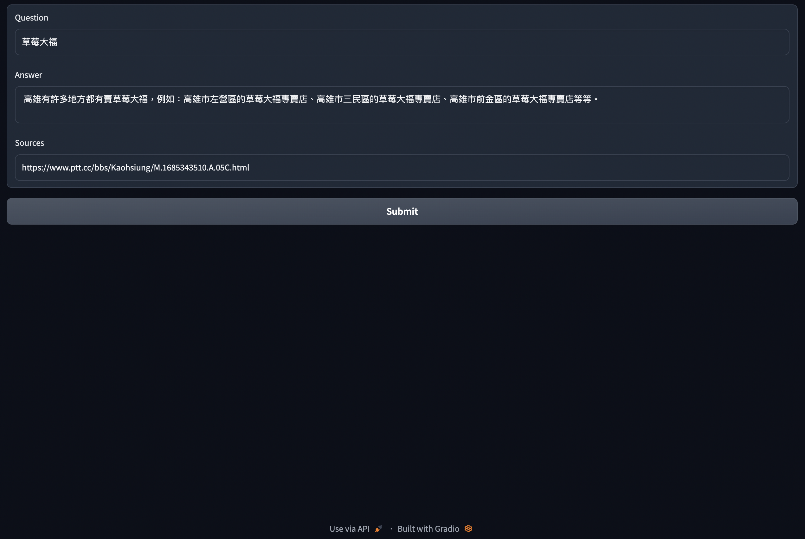

# PTT看板爬蟲跟QA機器人
用PTT爬蟲跟QA機器人示範langchain的使用。

## 安裝
建議使用Conda設定專用的環境
```
conda create -n ptt_bot
conda activate ptt_bot
```
```
pip install -r requirements.txt
```

## 爬蟲
`ingest_with_url_loader.py`這隻爬蟲有下列參數:
```
usage: ingest_with_url_loader.py [-h] [--board_name BOARD_NAME] [--num_list_pages NUM_LIST_PAGES]
                                 [--persist_db_location PERSIST_DB_LOCATION]

Ingest information from PTT posts

options:
  -h, --help            show this help message and exit
  --board_name BOARD_NAME
                        Name of board to ingest
  --num_list_pages NUM_LIST_PAGES
                        Number of list pages to ingest
  --persist_db_location PERSIST_DB_LOCATION
                        Location on disk to persist the db
```
1. board_name：輸入PTT看板的名字。例如：`Japan_Travel`、`Kaohsiung`、`Gossiping`
2. num_list_pages：爬蟲程式要爬多少頁文章列表頁
3. persist_db_location：爬到的文章會除存在一個向量資料庫裏面。存放向量資料庫的位址

### 爬蟲使用範例
```
$ python3 ingest_with_url_loader.py --board_name Kaohsiung
Processing list pages 4991 to 5001
Compiling urls from list pages in range 4991 to 5001
Compiled 194 urls
Loading URLs
Splitting documents
Creating vectorstore
Persisting vectorstore
```
完成之後會在目錄建立`persist_db_location`參數的目錄存放向量資料庫。

## QA機器人
### CLI
```
$ python3 qa.py -h
usage: qa.py [-h] [--persist_db_location PERSIST_DB_LOCATION] question

Ask a question

positional arguments:
  question              The question to ask

options:
  -h, --help            show this help message and exit
  --persist_db_location PERSIST_DB_LOCATION
                        Location on disk to persist the db
```
### CLI範例
```commandline
$ python3 qa.py "草莓大福"
Answer:  高雄市有許多店家賣草莓大福，例如：高雄市三多店、高雄市新興區草莓大福專賣店、高雄市鳳山區草莓大福專賣店等。

Sources: https://www.ptt.cc/bbs/Kaohsiung/M.1685343510.A.05C.html
```

### web介面
```commandline
$ python3 web.py
Running on local URL:  http://127.0.0.1:7860

To create a public link, set `share=True` in `launch()`.
```
